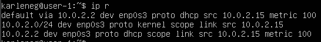
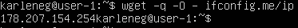
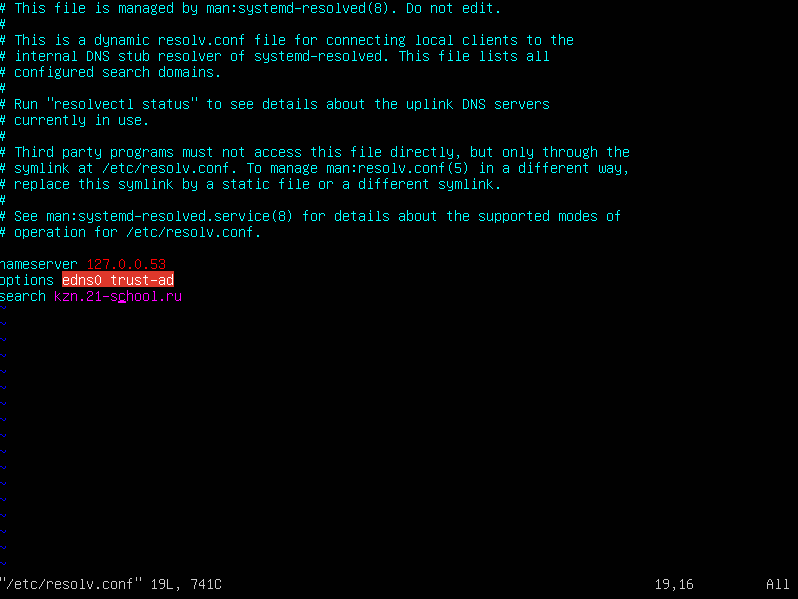
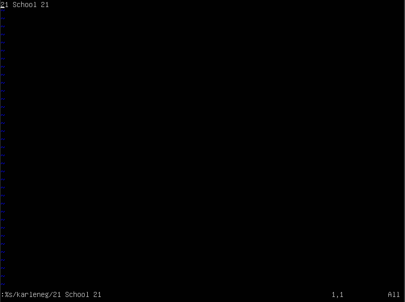
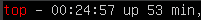
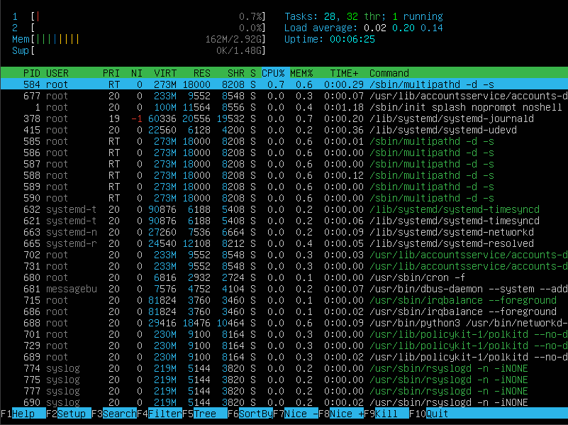

## Part 1. Установка ОС

Версия Ubuntu: 
Команда: cat /etc/issue 

## Part 2. Создание пользователя

Создание пользователя с именем karleneg_2: 
Команда: sudo adduser karleneg_2 

Выдача прав администратора пользователю karleneg_2: 
Команда: sudo usermod -aG adm karleneg_2 

Проверка создания пользователя: 
Команда: cat /etc/passwd 

## Part 3. Настройка сети ОС

Смена имени машины на user-1: 
Команда: hostnamectl set-hostname user-1 
Команда для проверки имени машины: cat /etc/hostname 

### Установить временную зону, соответствующую вашему текущему местоположению.

Команда для установки временной зоны: sudo timedatectl set-timezone Europe/Mockow 
Вывод времени: 
 

### Вывести названия сетевых интерфейсов с помощью консольной команды.

Команда для отображения названия сетевых интерфейсов:  
sudo ip link show 
 

Устройство lo (loopback device) — это специальный виртуальный сетевой интерфейс, который ваш компьютер использует для связи с самим собой. Он используется в основном для диагностики и устранения неполадок, а также для подключения к серверам, работающим на локальном компьютере. С этим интерфейсом всегда связан адрес 127.0.0.1. У него есть dns-имя – localhost.

### Используя консольную команду получить ip адрес устройства, на котором вы работаете, от DHCP сервера.

Команда для получения ip адреса: ip r 
 

DHCP — протокол прикладного уровня модели TCP/IP, служит для назначения IP-адреса клиенту. Это следует из его названия — Dynamic Host Configuration Protocol. IP-адрес можно назначать вручную каждому клиенту, то есть компьютеру в локальной сети. Но в больших сетях это очень трудозатратно, к тому же, чем больше локальная сеть, тем выше возрастает вероятность ошибки при настройке. Поэтому для автоматизации назначения IP был создан протокол DHCP.

### Определить и вывести на экран внешний ip-адрес шлюза (ip) и внутренний IP-адрес шлюза, он же ip-адрес по умолчанию (gw).

Команда для вывода внутреннего ip-адреса шлюза: wget -q -O - ifconfig.me/ip 
 

Команда для вывода внешнего ip-адреса шлюза: ip route | grep default 
 

### Задать статичные (заданные вручную, а не полученные от DHCP сервера) настройки ip, gw, dns (использовать публичный DNS серверы, например 1.1.1.1 или 8.8.8.8).

Изменение параметров для: ip, gw, dns 
Для замены параметров: ip, gw, dns, был отредоктирован файла /etc/resolv.conf 
 

Перезагрузка виртуальной машины 
Команда: reboot 

Пропинговка удаленных хостов 1.1.1.1 и ya.ru 
 
 

## Part 4. Обновление ОС
Команда для получения обновления листа обновлений : sudo apt update 
 

Установка всех пакетов: sudo apt full-upgrade 
 

Проверка обновлений: sudo apt update 
 
Т.к команда вывела: All packages are up to date. Все пакеты были установлены. 

## Part 5. Использование команды sudo

Главное назначение sudo — это выполнить команду от имени другого пользователя, обычно от root. Смысл выполнения команды от root в том, что у него повышенные права доступа и, применяя sudo, обычный пользователь может выполнить те действия, на которые у него недостаточно прав.

Выдача прав на использование sudo пользователю karleneg_2: 
Команда: sudo usermod -a -G sudo karleneg_2 

Переключение на другого пользователя 
Команда: su - karleneg_2 
 

Изменение имени виртуальной машины на user: 
 

## Part 6. Установка и настройка службы времени

Вывод времени(часового пояса в котором я сейчас нахожусь) 
Команда: date 
 

Вывод полного отображения времени 
Команда: timedatectl show 
 

## Part 7. Установка и использование текстовых редакторов

###Проверка наличия VIM, NANO, JOE на ОС 
Команда: sudo apt-get install X - (X = название редактора) 
VIM: 
 
NANO: 
 
JOE: 
 

###Создание файлов по Task:
Команда: touch test_X.txt(X - название редактора) 
VIM: 
 
NANO: 
 
JOE: 
 

Проверка создания: 
Команда: ls 
 

### Запись своего никнейма в файлы с сохранением
VIM: 
Команда для открытия: vim text_vim.txt 
Для редактирования содержимого необходимо перейти в режим INSERT: для этого нужно нажать i 
Команда для выхода с сохранием: :wq 
 
Проверка: 
 
NANO: 
Команда для открытия: nano text_nano.txt 
Команда для выхода с сохранием: ctrl+x y 
 
Проверка: 
 
JOE: 
Команда для открытия: joe text_joe.txt 
Команда для выхода с сохранием: ctrl+k x 
 
Проверка: 
 

### Запись 21 School 21 в файлы без сохранением
VIM: 
Команда для выхода без сохранием: q! 
 
Проверка: 
 
NANO: 
Команда для выхода без сохранием: ctrl+x n 
 
Проверка: 
 
JOE: 
Команда для выхода без сохранием: ctrl+k q n 
 
Проверка: 
 
P.S: но JOE создал временный файл text_joe.txt~ 
 

### Поиск по содержимому файла через редактор и замена найденного содержимого
VIM: 
Команда для поиска: /karleneg 
Команда для замены: :%s/karleneg/21 School 21 
 
 
 
NANO: 
Команда для поиска: ctrl+w 
Команда для замены:  
 
 
 
 
JOE: 
Команда для поиска: ctrl+k f 
Команда для замены: ctrl+k f <слово> r <слово> 
 
 
 

## Part 8. Установка и базовая настройка сервиса SSHD

Установка SSHD: 
Команда: sudo apt install openssh-server 
 

Автостарт SSHD 
Команда: sudo update-rc.d ssh defaults 
 

Перенастройка службы SSHd на порт 2022: 
Команда: sudo vim /etc/ssh/sshd_config 
 

Вступление изменений в силу: 
Команда: /etc/init.d/ssh restrart 
 

Проверка наличия процесса sshd: 
ps - отображает все процессы ОС. Можно использовать с grep для поиска нужного процесса. 
Флаги: 
    -ax - отображение всех процессов использую BSD стиль, принадлежащий пользователю и ОС. 
    -f - отображение в полном формате. 
    -v - отображение информации о версии. 
Команда: ps -a -x -f -v | grep sshd 
 

Использование netstat -tan: 
Установка netstat 
Команда: sudo apt install net-tools 
 

Объянение tan: 
    t - Отображение соединений через протокол TCP. 
    a - Отображает состояние всех сокетов. 
    n - Отображение IP-адреса, а не сетевого имени. 
Команда: netstat -tan 
 
Значения столбцов: 
    Proto - протокол. 
    Recv-Q - Высокий Recv-Q означает, что данные помещаются в буфер приема TCP/IP, но приложение не вызывает recv() для их копирования из буфера TCP/IP в буфер приложения. Клиент может проверить приложение, прослушивающее порт, и убедиться, что оно работает должным образом. 
    Send-Q - High Send-Q означает, что данные помещены в буфер отправки TCP/IP, но не отправлены или отправлены, но не подтверждены. Таким образом, высокое значение в Send-Q может быть связано с перегрузкой сети сервера, проблемой производительности сервера или управлением потоком пакетов данных и так далее. 
    Local Address - локальный адрес/номер порта сокета. 
    Foreign Address - удаленный адрес/номер порта сокета. 
    State - состояние сокета. 
    0.0.0.0 или ::: - Все IP-адреса на локальной машине. 
## Part 9. Установка и использование утилит top, htop
 

top - команда предоставляет сведенья о наиболее интенсивных процессах выполняемых в настоящее время. 
Запуск утилиты top: 
 

Отображение uptime: 
Команда: top | grep top 
 

Отображение количества авторизованных пользователей: 
Команда: top | grep user 
 

Отображение общей загрузки системы: 
Команда: top | grep load averange 
 

Отображение общего количества процессов: 
Команда: top |grep Tasks 
 

Отображение загрузки CPU: 
Команда: top | grep Cpu 
 

Отображение загрузки памяти: 
Команда: top | grep MiB 
 

Отображение PID процесса занимающего больше всего памяти: 
Команда: top -o RES 
 

Отображение PID процесса, занимающего больше всего процессорного времени: 
Команда: top -o TIME+ 
 

htop - Усовершенствованный вариант команды top. htop поддерживает работу с мышью, использует цвет в своем выводе и дает визуальные указания об использовании процессора, памяти и подкачки. 
Запуск утилиты htop: 
 

Отображение данных отсортированный по PID, PERCENT_CPU, PERCENT_MEM, TIME: 
Команда:htop F6 выбор Enter 
PID: 
 
PERCENT_CPU: 
 
PERCENT_MEM: 
 
TIME: 
 

Отображение данных отфильтрованных для процесса SSHD: 
Команда: htop F4 sshd Enter 
 

Отображение данных с процессом syslog, найденных, используя поиск: 
Команда:htop F3 syslog Enter 
 

Отображение данных с добвленным выводом hostname, clock и uptime: 
Команда:htop F5 
 

## Part 10. Использование утилиты fdisk
Команда: sudo fdisk -l 
 
Название жесткого диска: ubuntu--vg-ubuntu-lv. 
Размер: 8854175744 байт. 
Количество секторов: 17293312 секторов. 
Размер swap: 1551356. 

## Part 11. Использование утилиты df
Команда: sudo df 
 
Отчет для корневого раздела (/): 
    - размер раздела - 8408452.
    - размер занятого пространства - 4103804.
    - размер свободного пространства - 3855932.
    - процент использования - 52.
    - еденица измерения - Кб.

Команда: sudo df -Th 
 
Отчет для корневого раздела (/): 
    - размер раздела - 8.1.
    - размер занятого пространства - 4.
    - размер свободного пространства - 3.7.
    - процент использования - 52%.
    - еденица измерения - Гб.
    - тип файловой системы для раздела - etx4.

## Part 12. Использование утилиты du

Использование du: 
Команда: sudo du 
 

Вывести размер папок /home, /var, /var/log: 
Команда: sudo du -s -h /home /var && sudo du -s -h /var/log 
Флаги: 
    -s - отображения данных для каждого аргумента. 
    -h - вывод данных в читабельном для людей виде. 
 

Вывести размер всего содержимого в /var/log: 
Команда: sudo du -h -a /var/log 
Флаг -a - выводить размер для всех файлов, а не только для директорий, по умолчанию размер выводится только для папок.  
 

## Part 13. Установка и использование утилиты ncdu

Установка ncdu: 
Команда:sudo apt install ncdu 
 

Отображение размера /home: 
Команда:ncdu /home 
 

Отображение размера /var: 
Команда:ncdu /var 
 

Отображение размера /var/log: 
Команда:ncdu /var/log 
 

## Part 14. Работа с системными журналами
 

Время последней успешной авторизации, имя пользователя и метод входа в систему: 
Команда: last 
 
Время последней успешной авторизации: 30.10.2022 23:34. 
Имя пользователся: karleneg. 
Метод входа в система: tty1. 

Перезапустить службу SSHd: 
Команда: /etc/init.d/ssh restrart 

Сообщение о рестарте службы: 
Команда: sudo cat /var/log/syslog | grep  
 

## Part 15. Использование планировщика заданий CRON
Установка CRON: 
Команда: sudo apt install cron 
 

Планирование задачи в CRON: 
Команда: crontab -e 
 

Заплонировать задачу uptime каждые 2 минуты: 
Команда: */2 * * * * uptime 
 

Вывод текущих задач: 
Команда: crontab -l 
 

Поиск в журналах логов о выполнении задачи uptime: 
Команда: sudo grep CRON /var/log/syslog 
 

Удаление всех задач из планировщика CRON: 
Команда: crontab -r 
 
